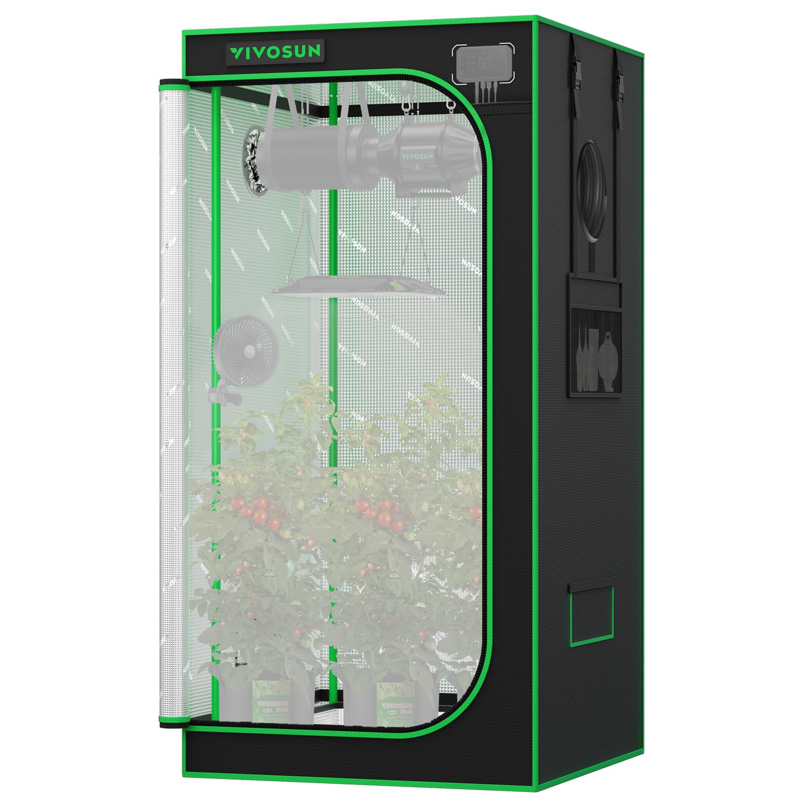

# Grow Tent Details

!!! info "Grow Tent Information"

    - Tent Brand - Vivosun
    - Dimesions - 32" x 32" x 63"
    - Humidifier - Yes (Govee 3L Top Fill Cool Mist Humidifier)
    - Thermo-Hygrometer - Yes (Govee Smart Hygrometer)
    - Grow Light - 150W Aerolight
    - Duct Fan - AeroZesh S4
    - Circulation Fans x2 - 1 USB Powered Floor Fan / 1 Vivosun Aerowave E6 Fan

    

---

### Humidity / Temps and Light Cycles

!!! success "Humidity / Temp / Light Cycle Levels"

    ### **Humidity** - Maintained Between 65% - 75% for Veg

    ### **Temperature** - Maintained at 65-75 Degrees F

    ### **Light Cycle** - 20 Hours On - 4 Off Until Flowering.