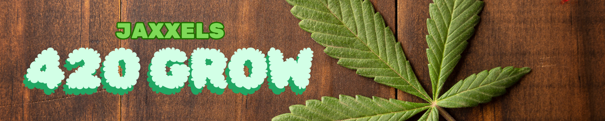

# Welcome
## Jaxxel's 4/20 Grow

### Hello & Welcome

Welcome to Jaxxels 420 Grow!

Hey there, fellow green thumbs and cannabis enthusiasts! I’m thrilled to welcome you to my blog, where I share my personal journey and experiences in growing cannabis for medical use. This space is all about cultivating not just plants, but knowledge, wellness, and a supportive community.

My name is Jax, and like many of you, I’ve discovered the incredible benefits of cannabis for medical purposes. Through trial and error, late-night research marathons, and a whole lot of patience, I’ve learned a thing or two about nurturing these amazing plants. And now, I want to pass that wisdom onto you.

Here at Jaxxels 420 Grow, you’ll find a mix of detailed grow guides, honest reviews of products and strains, troubleshooting tips, and personal stories from my own cannabis cultivation adventure. Whether you're a seasoned grower or just starting out, I hope you'll find something here that sparks your interest and helps you on your own journey.

So grab a cup of your favorite herbal tea, settle in, and let’s grow together. Welcome to Jaxxels 420 Grow – where every leaf has a story, and every story is worth sharing.

Stay green,
Jax

---

### About the Author

Hello, I’m J.C., and welcome to Jaxxels 420 Grow!

A proud native of St. Louis, MO, I have been passionately involved in the world of medical cannabis for over 15 years. My journey began out of necessity, seeking alternative treatments for chronic illness and other debilitating conditions. Through the ups and downs, I’ve become a staunch advocate for the legalization and medical usage of cannabis, believing wholeheartedly in its power to provide relief and improve quality of life.

As someone who's navigated the complex maze of growing and using cannabis medicinally, I understand the challenges and rewards that come with it. My mission is to share what I’ve learned along the way, in hopes that it might ease the path for others who are just starting out or are looking for better ways to make their plants thrive.

Beyond my personal experiences, I'm deeply committed to advocating for broader accessibility and eliminating the stigma around cannabis use. Every person should have the right to explore and benefit from the healing properties of this extraordinary plant.

Thank you for joining me on this green journey. Whether you’re here to learn, share, or simply connect, I’m excited to grow with you.

---

### Disclaimer

The content provided on Jaxxels 420 Grow is for informational and educational purposes only. We are not here to provide medical advice, nor do we recommend using cannabis for medical purposes without first consulting a qualified healthcare professional. 

Please note, I am not a doctor, nor am I qualified to give medical advice. The information shared on this blog is based on my personal experiences and research, and should not be taken as professional medical guidance.

Before starting or altering any cannabis regimen, it is crucial to talk to your doctor to ensure it is safe and appropriate for your specific health needs. 

Additionally, cannabis laws vary widely from state to state and country to country. Please make sure to observe and comply with the laws and regulations surrounding cannabis in your jurisdiction.

Stay informed, stay safe, and thank you for being a part of Jaxxels 420 Grow.