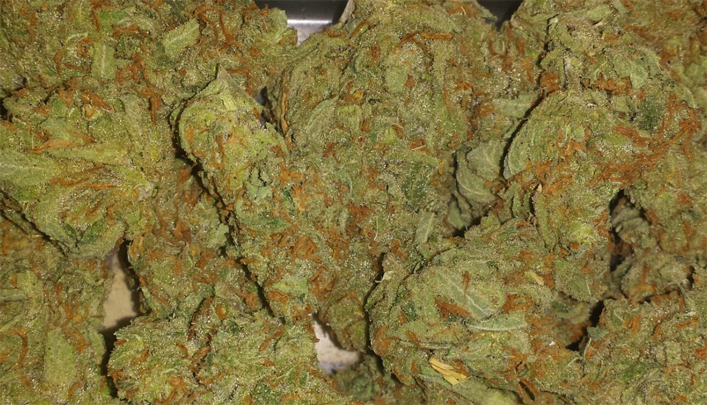

# Mango Haze

## About Mango Haze

Mango Haze is a sativa marijuana strain made by crossing Northern Lights #5, Skunk, and Haze. Mango Haze produces uplifting and happy effects that will put you into a cerebral mood. This strain features a mango aroma and flavor that consumers love. Medical marijuana patients choose this strain to help relieve symptoms associated with depression.

### Strain Highlights

| Category   | Details               |
|------------|-----------------------|
| Feelings   | Energetic, Focused, Tingly           |
| Negatives  | Anxious, Dizzy, Dry Eyes             |
| Helps with | Stress, Anxiety, Depression              |

### Facts 

**Mango Haze grow information**

 - Yields around 450 to 550 grams per meter squared
 - Responds well to topping
 - Medium to heavy feeder
 - Flowering time of 66 days

---

### Images

