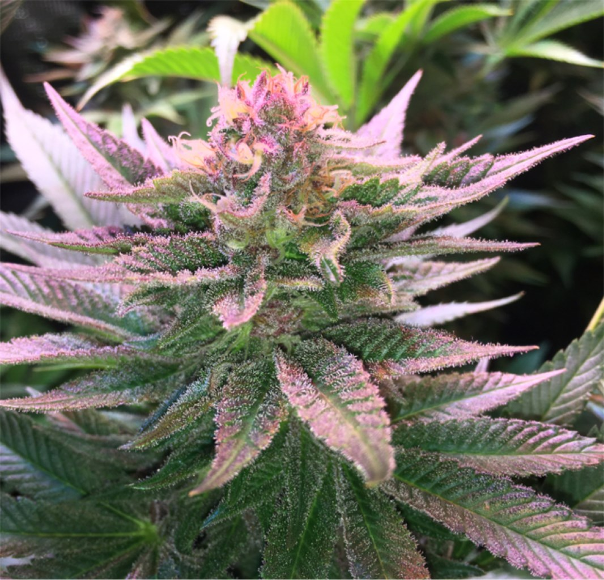

# Purple Punch

## About Purple Punch

Purple Punch is the sweet and sedating union of two indica-dominant classics. By breeding Larry OG with Granddaddy Purple, the astonishing trichome laden Purple Punch was born, smelling of grape candy, blueberry muffins, and tart Kool-Aid. The potency of this strain gives the consumer a one-two punch to the head and body, initially landing between the eyes and settling down into the limbs. Purple Punch is a delicious dessert strain that is best suited for after dinner. Its effects may help with managing nausea, stress, minor body aches, and sleeplessness.

### Strain Highlights

| Category   | Details               |
|------------|-----------------------|
| Feelings   | Sleepy, Hungry, Relaxed              |
| Negatives  | Dizzy, Dry Mouth, Dry Eyes               |
| Helps with | Anxiety, Stress, Pain             |

### Cultivation Details

- **Veg:** Moderate
- **Flower:** 60-70 days
- **Stretch:** Moderate

**Cultivator Notes:**
- Extending flower time increases gassy terps.

---

### Images

