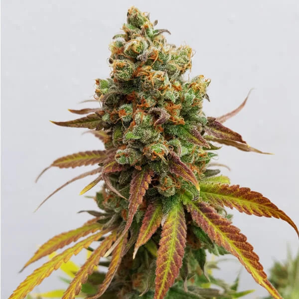
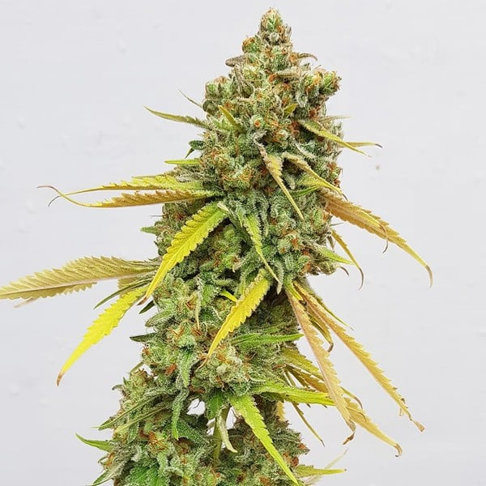

# Special Queen #1

## About Special Queen #1

|Hybrid|50/50|.hybrid|

R|Breeder Strain Page|Special Queen 1|

[Special Queen 1]: https://www.royalqueenseeds.com/us/feminized-cannabis-seeds/139-special-queen-1.html

!!! info 

    In the '90s there was a mad dash from seed breeders and sellers to find that ultimate skunk. During this period, lots of growers tried to replicate that Mexican, Colombian, Afghan hybrid which resulted in a huge variety of new generation skunks. The genetic features of these cannabis plants would eventually lay the foundation for almost every marijuana plant in Europe.

    At Royal Queen Seeds, we decided to bring you a classic Skunk hybrid at a lower price by crossing Skunk with Power Bud strain. Perfect for a first-time grower who doesn't want to invest too much in his experimental growing. This Special Queen is a classic skunk that grows with ease, doesn't stretch too much and can be harvested in 8-9 weeks.

!!! info "Effects of Special Queen #1"

    | Effects Noted From Breeder            |
    |----------------------|
    | Long Lasting         |
    | Physically Relaxing  |
    | Powerful             |

!!! info "Cultivation Details"

    - **Veg:** Moderate
    - **Flower:** 8 - 9 weeks
    - **Stretch:** 	3 to 5 feet

    **Cultivator Notes:**
    -  N/A

---

### Images

!!! info 

    
    

    Images Courtesy of Breeder. I take no credit for images.